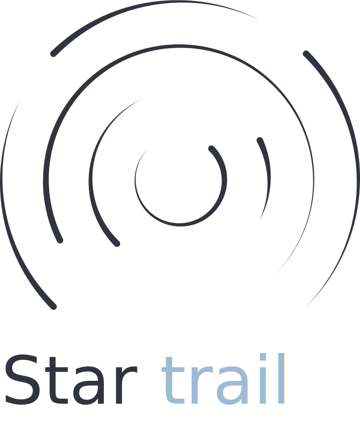
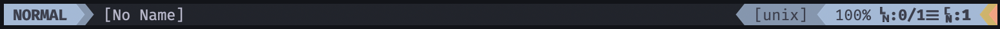
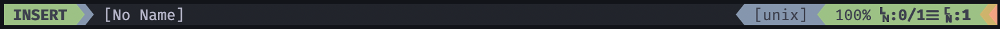
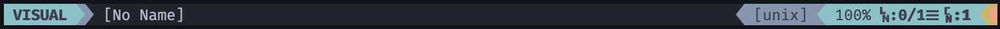
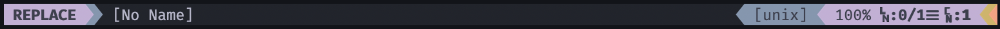

<p align="center">
  </img>
</p>

<h1 align="center">A colorscheme from the stars</h1>

Startrail a dark & peaceful colorscheme for [Vim](https://www.vim.org/) & [Neovim](https://neovim.io/), initially forked from [arzg](https://github.com/arzg)'s [Substrata](https://github.com/arzg/vim-substrata) and inspired by [startrails](https://www.google.com/search?q=startrail).

## Usage

Set the colorscheme inside `.vimrc` or `init.vim`:

```vim
colorscheme startrail
```

On terminal emulators, make sure to set neovim to use `truecolor` in order for Startrail to work as expected:

```vim
set termguicolors
```

You can enable/disable italics through `g:startrail_italic_comments` and `g:startrail_italic_functions`, see `:h startrail` for more information.

## Airline

Startrail also includes an [Airline]() theme, make sure to set `g:airline_theme` to `startrail` in your config file.






## Terminal

If you want other terminal output to match with Substrata, then set your terminal emulator’s colours to match the ones below:

| Color      | Normal    | Bright    |
| ---------- | --------- | --------- |
| Black      | `#21242c` | `#32343e` |
| Red        | `#cf8164` | `#fe9f7c` |
| Green      | `#76a065` | `#92c47e` |
| Yellow     | `#ab924c` | `#d2b45f` |
| Blue       | `#8296b0` | `#a0b9d8` |
| Magenta    | `#a18daf` | `#c6aed7` |
| Cyan       | `#659ea2` | `#7dc2c7` |
| White      | `#b5b4c9` | `#f0ecfe` |
| Foreground | `#b5b4c9` |           |
| Background | `#121419` |           |

There's an included [iTerm2](https://iterm2.com/) colorscheme inside `schemes`, double-click it and it sould automatically be imported, search for the `Startrail` colorscheme.

## Credits

Please note that this is only a slightly modified version of [vim-substrata](https://github.com/arzg/vim-substrata), make sure to show some love to the original creator.
